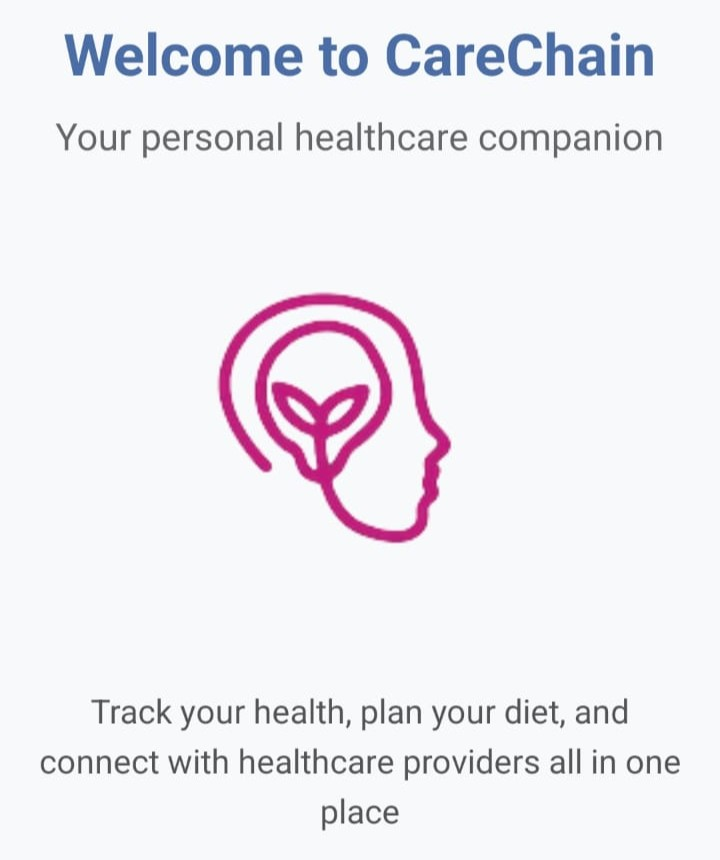
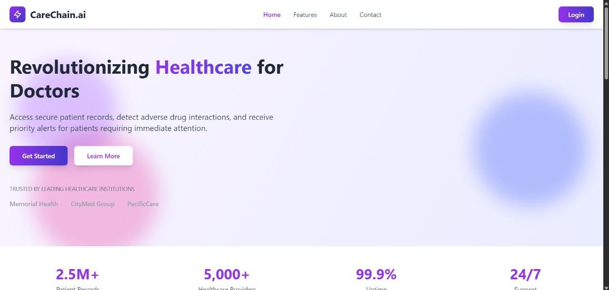
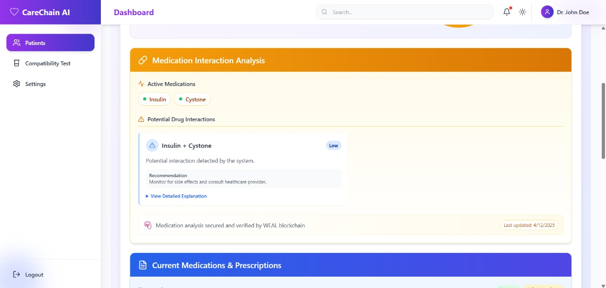
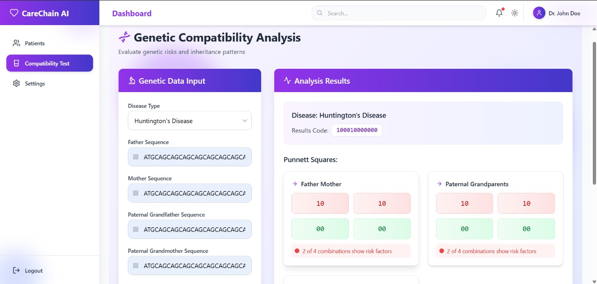
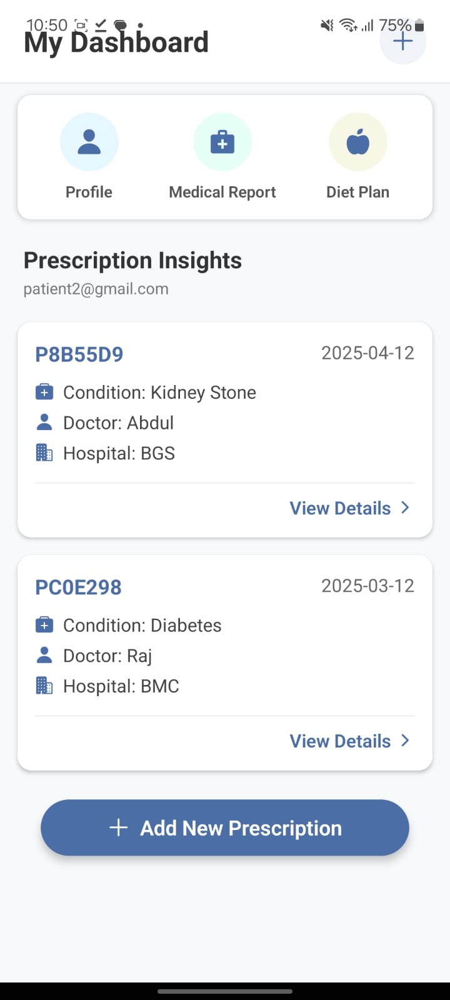

# CareChain.ai

[](https://opensource.org/licenses/MIT)

CareChain.ai is a revolutionary healthcare management platform that combines blockchain security with AI-powered insights to transform patient care. Built for healthcare professionals, it provides secure record management, intelligent analysis, and proactive health monitoring.



## 🌟 Features

### 🔒 Secure Patient Records
- Blockchain-powered secure storage of complete medical histories
- Tamper-proof documentation with multichain technology integration
- Privacy-focused design that keeps patients in control of their data

### 💊 Smart Prescription Management
- Upload and digitize paper prescriptions via OCR
- Track medication history and refill schedules
- Access prescription PDFs securely stored on IPFS

### ⚠️ Drug Interaction Analysis
- AI-powered detection of potential adverse drug interactions
- Severity assessment and recommendations for medication conflicts
- Intelligent alerts for healthcare providers

### 📊 Patient Risk Reports
- Comprehensive health risk assessment with visual scoring
- System-specific analysis (cardiovascular, respiratory, endocrine, renal)
- Personalized recommendations based on patient profiles

### 🍎 Personalized Diet Plans
- AI-generated nutrition guidance based on patient health data
- Customized meal plans for specific health conditions
- Daily nutritional recommendations

### 🧬 Genetic Compatibility Analysis
- Evaluate genetic risks and inheritance patterns
- Disease predisposition assessment
- Family health mapping

### 🩺 Streamlined Checkups
- Digital checkup documentation and history
- Vitals tracking and analysis over time
- Integration with health risk assessment

## 📱 Applications

### Web Portal (Healthcare Providers)
Provider-focused dashboard with full patient management capabilities


### Mobile App (Patients)
Patient-centric mobile experience for health tracking and data access


## 🔧 Technology Stack

### Frontend
- **Web**: React.js with Tailwind CSS
- **Mobile**: React Native with Expo

### Backend
- RESTful API services
- AI/ML processing for health insights
- Blockchain integration (multichain technology)

### Storage
- IPFS for decentralized document storage
- Blockchain ledger for data integrity

## 📋 Prerequisites

- Node.js (v14+)
- npm or yarn
- Expo CLI (for mobile app)
- Web3 wallet for blockchain features

## 🚀 Installation

### Web Application

```bash
# Navigate to web directory
cd CareChain/web

# Install dependencies
npm install

# Start development server
npm start
```

### Mobile Application
```bash
# Navigate to App directory
cd CareChain/App

# Install dependencies
npm install

# Start Expo development server
npx expo start
```

## 💻 Usage
For Healthcare Providers
1. Register your medical practice
2. Add patients to your practice
3. Manage patient records and prescriptions
4. Generate and review risk reports
5. Analyze potential drug interactions
6. Create checkup reports

For Patients (Mobile App)
1. Register and create your health profile
2. View your prescriptions and medical reports
3. Access your personalized diet plan
4. Receive medication reminders
5. Track your health metrics

## 📸 More Screenshots

### Landing Page


### Drug Interaction Analysis


### Genetic Analysis


### Patient App


## 🔗 Blockchain Integration
CareChain.ai uses multichain technology to provide:
- Immutable audit trails
- Cryptographic verification of medical records
- Secure, decentralized storage of sensitive data
- Patient-controlled access management

## 🛠️ Development
Project Structure

```
CareChain/
├── App/                # Mobile application
│   ├── app/            # Expo app directory
│   │   ├── (tabs)/     # Tab-based navigation
│   │   └── prescription/# Prescription views
├── web/                # Web application
│   ├── public/         # Static assets
│   └── src/            # Source code
│       ├── components/ # Reusable components
│       ├── contexts/   # React contexts
│       ├── pages/      # Page components
│       └── services/   # API services
```

## Contributing
1. Fork the repository
2. Create a feature branch: ```git checkout -b feature/amazing-feature```
3. Commit your changes: ```git commit -m 'Add amazing feature'```
4. Push to the branch: ```git push origin feature/amazing-feature```
5. Open a pull request

## 🔧 Technologies & Frameworks

### Frontend
- **Web**: React.js
- **Mobile**: React Native with Expo
- **Routing**: React Router DOM for web, Expo Router for mobile

### Backend
- **API Server**: FastAPI (Python)

### Blockchain
- **Blockchain Platform**: MultiChain
- **Decentralized Storage**: IPFS
- **Smart Contract Language**: Python integration with MultiChain APIs

## 👥 Team
- [Suprith](https://github.com/Suprith-44) - Blockchain Development & Mobile App
- [Rakshita S](https://github.com/Rakshitha-21) - Website Development & UI/UX Design
- [Saniya Naaz](https://github.com/Saniyanaaz11) - Documentation & Research
- [Madhusudan](https://github.com/keikurono7) - Mobile App & Website Development

## 📄 License
This project is licensed under the MIT License - see the LICENSE file for details.

© 2025 CareChain.ai. All rights reserved.